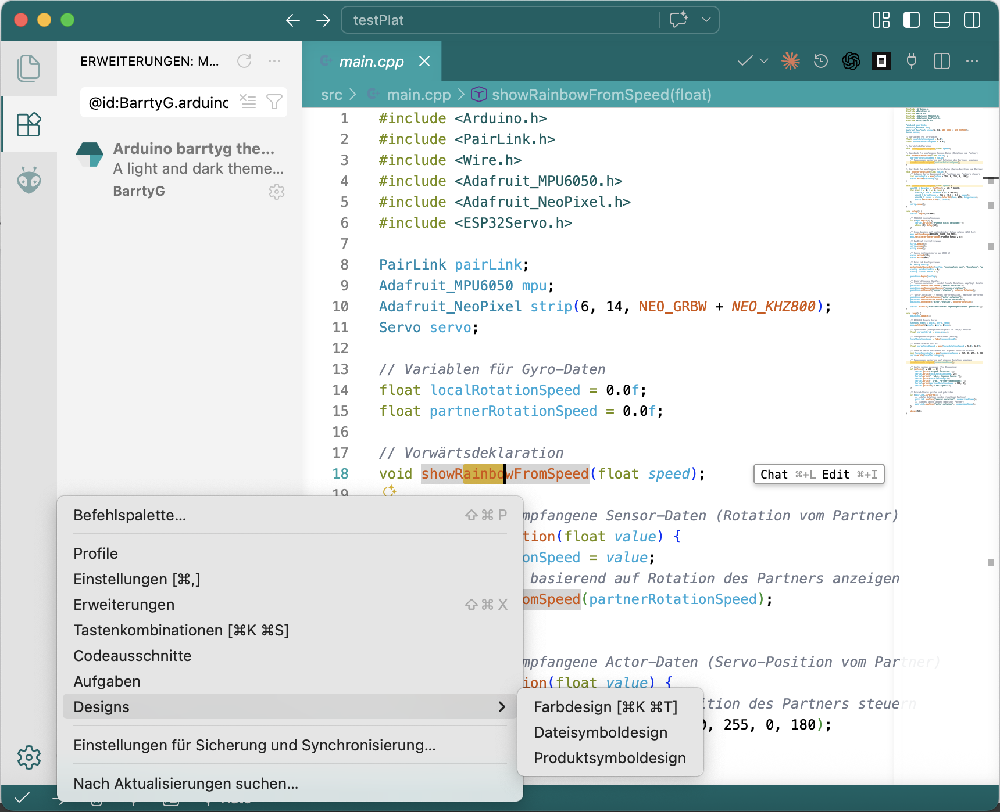
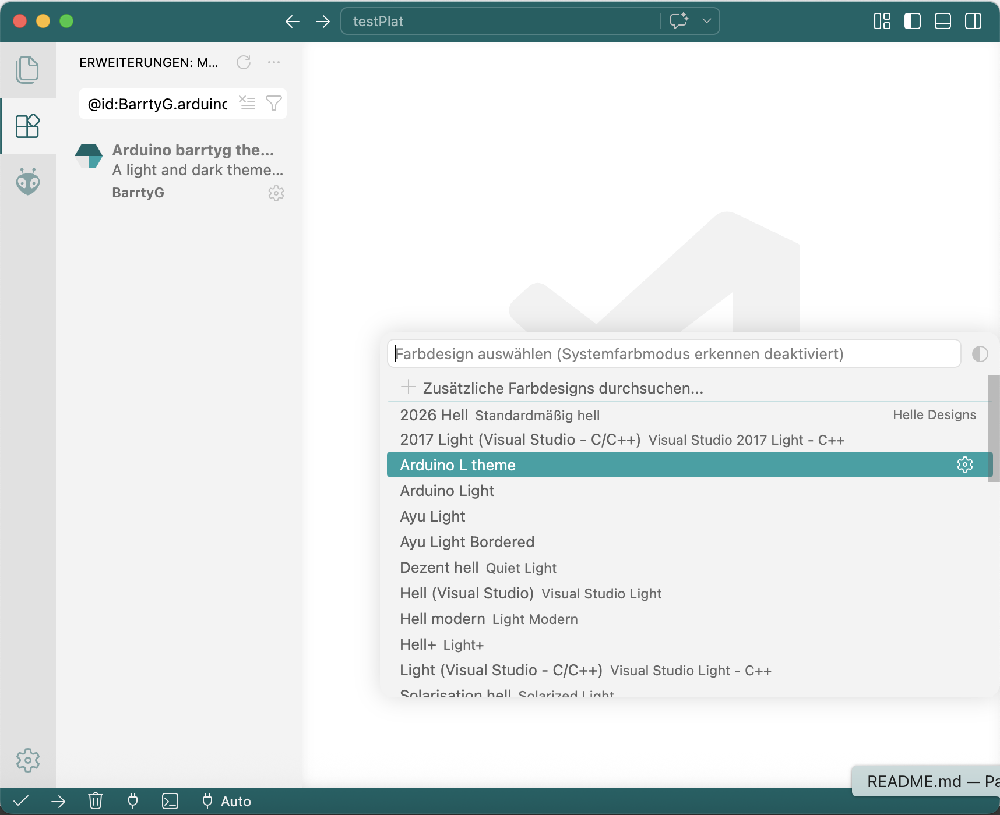
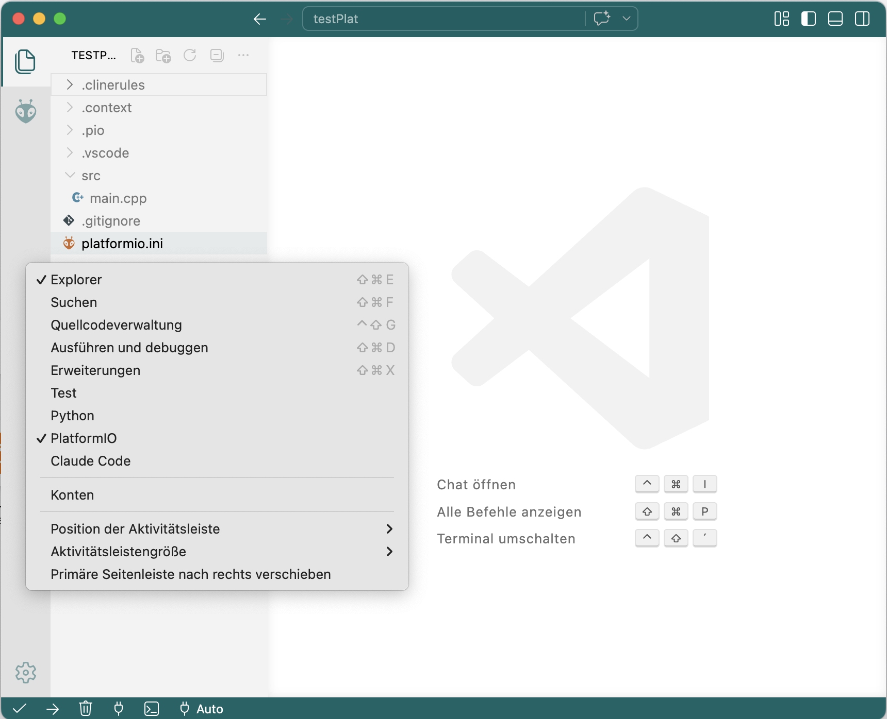
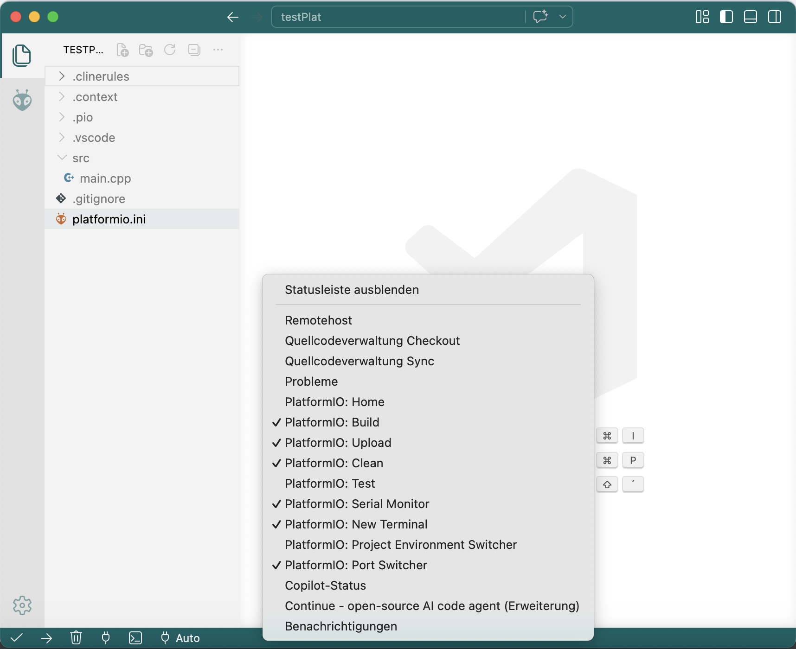

# VS Code — Oberfläche vereinfachen (optional)

VS Code bietet viele Symbole und Menüs — für den Einstieg kann das überladen wirken. Du kannst die Oberfläche **schrittweise anpassen**, ohne die Funktion zu verlieren. Die folgenden Abschnitte zeigen das mit **Screenshots** aus dem Workshop.

**Hinweis:** Mach diese Schritte **nach** der Installation von [Visual Studio Code](./README.md#schritt-2--visual-studio-code-installieren) und idealerweise **nach** [PlatformIO](./README.md#schritt-3--platformio-in-vs-code-installieren), damit du die wichtigsten Symbole (z. B. Erweiterungen, PlatformIO) noch erkennst.

---

## Neues Darstellungsdesign installieren

Über das **Farbdesign** (Theme) passt du Helligkeit und Kontrast an — das wirkt oft schon wie eine „aufgeräumtere“ Oberfläche.

1. Öffne die **Befehlspalette**: `Strg+Shift+P` (Windows/Linux) bzw. `Cmd+Shift+P` (macOS).
2. Tippe **Color Theme** bzw. **Farbdesign** und wähle **Einstellungen: Farbdesign** / **Preferences: Color Theme**.
3. In der Liste kannst du mit den **Pfeiltasten** durch die Themes wechseln und so live vergleichen.

Im Workshop ist z. B. ein helles Theme wie **Arduino Light** gut lesbar — du findest es in den Erweiterungen (Suchbegriff z. B. `Arduino Light`) und wählst es danach ebenfalls unter **Farbdesign**.

---

## Aktivitätsleiste aufräumen

Die **Aktivitätsleiste** ist die vertikale Leiste ganz links (Dateien, Suche, Git, Erweiterungen …). Einträge, die du selten brauchst, kannst du ausblenden — **Rechtsklick** auf die Leiste und die nicht benötigten Ansichten abwählen.

Behalte mindestens **Dateien** und **Erweiterungen** (und nach Installation **PlatformIO**), damit du den Workshop-Workflow nicht blockierst.

---

## Untere Toolbar (Statusleiste) aufräumen

Die **Statusleiste** unten zeigt u. a. Port, Zeilenende und Sprache. Auch hier hilft der **Rechtsklick**: Du blendest nur die Anzeigen ein, die du brauchst — z. B. **COM-Port** und **PlatformIO** für Upload und Serial Monitor.

---

## Zurück zum Setup

- [Setup — Schritt für Schritt](./README.md)
