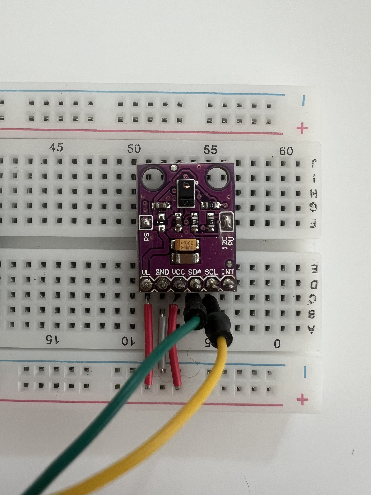

# APDS9960 · Gestensensor

Der APDS9960 ist der Standard-Eingabesensor im Workshop. Er erkennt Handbewegungen, die nah an der Sensoroberfläche ausgeführt werden.

---

## Was er erkennt

- Wischgesten (links, rechts, oben, unten)
- Nähe (wie weit ist eine Hand entfernt)
- **Umgebungslicht und Farbe** — mit der **Adafruit APDS9960 Library**: Rohkanäle R/G/B und „Clear“, daraus z. B. **Lux** (Helligkeit) und **Farbtemperatur** (`getColorData`, `calculateLux`, `calculateColorTemperature`). Im Workshop genauso erlaubt wie Geste und Nähe, wenn du das in der Idee beschreibst.

## Wie er im GPT beschrieben wird

Im Prompt musst du den Sensor nicht beim Namen nennen. Es genügt zu sagen:

> „...gesteuert durch eine Handbewegung..."
> „...wenn jemand die Hand über den Sensor hält..."
> „...ausgelöst durch eine Geste..."
> „...reagiert auf Helligkeit / Licht / Schatten..."
> „...Farbe der Umgebung / farbiges Licht..."

Der GPT wählt automatisch den APDS9960 als Standard-Eingabesensor, wenn kein anderer angegeben ist. Für **Licht oder Farbe** den APDS9960 explizit erwähnen oder schreiben, dass der **gleiche Sensor** wie für Gesten genutzt werden soll — dann kann der Code `enableColor(true)` und die Farb-/Lux-Hilfsfunktionen der Library verwenden.

## Anschluss

Verbunden über I²C:
- SDA → GPIO 21
- SCL → GPIO 22

Bibliothek: `Adafruit APDS9960 Library`

---

## Referenzen & Dokumentation

| Ressource | Link |
|---|---|
| APDS-9960 Datenblatt (Broadcom) | [broadcom.com · PDF](https://docs.broadcom.com/doc/AV02-4191EN) |
| Adafruit APDS9960 Library (GitHub) | [github.com/adafruit/Adafruit_APDS9960](https://github.com/adafruit/Adafruit_APDS9960) |
| Adafruit APDS9960 Library (PlatformIO) | [registry.platformio.org](https://registry.platformio.org/libraries/adafruit/Adafruit%20APDS9960%20Library) |
| Adafruit Breakout Board Guide | [learn.adafruit.com/adafruit-apds9960-breakout](https://learn.adafruit.com/adafruit-apds9960-breakout) |
| SparkFun Hookup Guide | [learn.sparkfun.com/apds9960](https://learn.sparkfun.com/tutorials/apds-9960-rgb-and-gesture-sensor-hookup-guide) |
