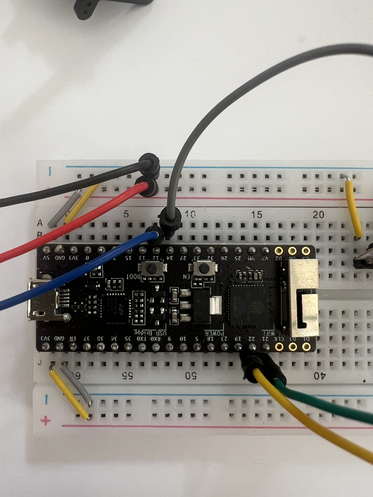
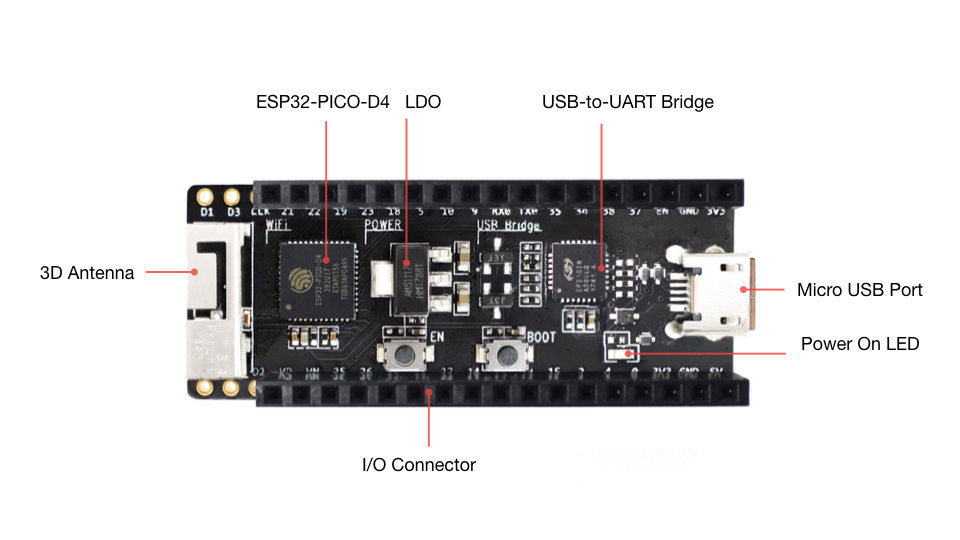
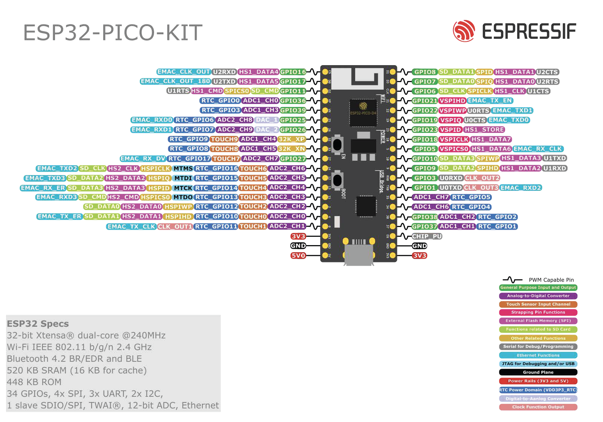

# ESP32-PICO-KIT · Entwicklungsboard

Das **ESP32-PICO-KIT** ist das offizielle Entwicklungsboard von Espressif, das auf dem **ESP32-PICO-D4** SiP (System-in-Package) basiert. Es ist das Herzstück des Workshops: ein kleines Board, das Code ausführt, Sensoren ausliest, Aktoren steuert und sich drahtlos mit anderen Geräten vernetzt.

---

## Was ist ein Mikrocontroller — und warum brauche ich den?

Wenn du noch nie mit Hardware gearbeitet hast, ist das der wichtigste Abschnitt.

Ein **Mikrocontroller** ist ein winziger Computer auf einem Chip. Er hat einen Prozessor, Speicher und Anschlüsse für externe Geräte — alles in einem. Er hat kein Betriebssystem, kein Display, keine Tastatur. Er macht genau eine Sache: **er führt ein Programm aus, das du darauf geladen hast.**

Das klingt limitierend, ist es aber nicht. Es macht ihn extrem zuverlässig, stromsparend und für physische Interaktion ideal.

**Konkret:** Du schreibst (oder generierst) Code, der sagt: „Wenn der Sensor eine Handbewegung erkennt, leuchte die LED auf." Du überträgst diesen Code über USB auf das Board. Das Board führt ihn sofort und dauerhaft aus — auch ohne Computer, auch nach dem Abstecken des USB-Kabels.

---

## Was das ESP32-PICO-KIT alles kann

Das Board ist für Anfänger ungewöhnlich mächtig. Hier ist eine ehrliche Übersicht:

### Programmlogik ausführen
Das Board hat einen **Dual-Core-Prozessor mit 240 MHz** — schnell genug für komplexe Berechnungen, Sensordaten in Echtzeit und Netzwerkkommunikation gleichzeitig. Es hat **520 KB RAM** (Arbeitsspeicher) und **4 MB Flash** (dauerhafter Speicher, auf dem dein Code liegt).

### Sensoren auslesen
Über die **I²C-Schnittstelle** (zwei Drähte: SDA + SCL) kann das Board mit einer Vielzahl von Sensoren kommunizieren. Im Workshop sind das der APDS9960 (Gesten, Nähe, Licht/Farbe) und der MPU6050 (Bewegung, Temperatur). Das Board kann gleichzeitig mit mehreren I²C-Geräten sprechen — sie teilen sich denselben Bus.

### Aktoren steuern
Über **GPIO-Pins** (General Purpose Input/Output — frei nutzbare Anschlüsse) kann das Board Signale senden und empfangen:
- **NeoPixel LEDs** per digitalem Datensignal (GPIO 14)
- **Servo-Motoren** per PWM-Signal (GPIO 12)
- **LEDs, Relais, Buzzer** — alles was ein digitales Signal versteht

### Drahtlos kommunizieren
Das Board hat **WLAN (802.11 b/g/n, 2.4 GHz)** und **Bluetooth 4.2** direkt eingebaut — keine zusätzliche Hardware nötig. Im Workshop nutzt du das WLAN, um zwei Boards über PairLink miteinander zu verbinden.

### Über USB mit dem Computer sprechen
Das ESP32-PICO-KIT hat einen **CP2102N USB-UART-Brückenchip** eingebaut. Damit erscheint das Board bei Anschluss sofort als serieller Port auf deinem Computer — du kannst Code flashen und Status-Nachrichten lesen, ohne etwas zu konfigurieren.

---

## Das Board im Detail

Die folgenden Abbildungen stammen aus der **Espressif**-Dokumentation zum ESP32-PICO-KIT und zeigen Layout (v4.1) sowie die Pinbelegung (v4).

### Draufsicht · Board-Layout (v4.1)

*Quelle: [Espressif Systems](https://www.espressif.com/) — Herstellerdokumentation zum ESP32-PICO-KIT.*

### Pinbelegung (v4)

*Quelle: [Espressif Systems](https://www.espressif.com/) — Herstellerdokumentation zum ESP32-PICO-KIT.*

**Reset-Knopf (RST):** Startet das Board neu, ohne es zu trennen — nützlich wenn der Code hängt.

**Boot-Knopf (BOOT / GPIO 0):** Hat zwei Funktionen: Im Workshop ist er der **Pairing-Button** für PairLink. Beim Start gedrückt halten versetzt das Board in den Flash-Modus (manuell selten nötig — PlatformIO macht das automatisch).

**Status-LED (GPIO 2):** Eine eingebaute LED. Im Workshop zeigt sie den PairLink-Verbindungsstatus an.

---

## Feste Pins im Workshop

Alle Anschlüsse sind vorbestimmt — der GPT kennt sie und verwendet sie automatisch:

| Funktion | Pin | Beschreibung |
|---|---|---|
| Pairing-Button | GPIO 0 | Bereits auf dem Board vorhanden (BOOT-Taste) |
| Status-LED | GPIO 2 | Bereits auf dem Board vorhanden (eingebaut) |
| Servo | GPIO 12 | Kabel zum Servo-Signal |
| NeoPixel | GPIO 14 | Kabel zum LED-Strip |
| I²C SDA | GPIO 21 | Shared Bus: APDS9960 + MPU6050 |
| I²C SCL | GPIO 22 | Shared Bus: APDS9960 + MPU6050 |

Du musst diese Nummern nicht kennen oder selbst angeben. Sie sind fest im GPT hinterlegt.

---

## Was passiert wenn du Code überträgst?

1. Du klickst in PlatformIO auf **Upload (→)**
2. PlatformIO kompiliert deinen Code zu Maschinensprache (dauert 10–30 Sekunden)
3. Das Board wird automatisch in den Flash-Modus versetzt
4. Der kompilierte Code wird über USB auf den 4 MB Flash-Speicher geschrieben
5. Das Board startet automatisch neu und führt den Code aus

Ab diesem Moment läuft dein Programm — unabhängig vom Computer. Das Board braucht nur noch Strom (USB oder externe 5V-Quelle).

---

## Technische Spezifikation

| Merkmal | Wert |
|---|---|
| Board | ESP32-PICO-KIT v4.1 |
| Chip | ESP32-PICO-D4 (SiP, System-in-Package) |
| Prozessor | Xtensa LX6 Dual-Core · 240 MHz |
| Flash | 4 MB (integriert im SiP) |
| RAM | 520 KB SRAM |
| WLAN | 802.11 b/g/n · 2.4 GHz |
| Bluetooth | BT 4.2 + BLE |
| USB-Brücke | CP2102N (kein extra Treiber unter macOS 10.15+) |
| GPIO | 34 programmierbare Pins |
| I²C | 2 × Hardware-I²C (Workshop: SDA=21, SCL=22) |
| PWM | Alle GPIO-Pins PWM-fähig |
| ADC | 12-bit · 18 Kanäle |
| Spannungsversorgung | 5V via USB oder extern |
| Abmessungen | 52 × 20.3 mm |
| PlatformIO Board-ID | `pico32` |

---

## Referenzen & Dokumentation

| Ressource | Link |
|---|---|
| **ESP32-PICO-KIT Getting Started** (Espressif) | [docs.espressif.com · Pico-Kit](https://docs.espressif.com/projects/esp-idf/en/latest/esp32/hw-reference/esp32/get-started-pico-kit.html) |
| **ESP32-PICO-D4 Datenblatt** | [espressif.com · PDF](https://www.espressif.com/sites/default/files/documentation/esp32-pico-d4_datasheet_en.pdf) |
| ESP32-PICO-KIT Schematic (v4.1) | [dl.espressif.com · PDF](https://dl.espressif.com/dl/schematics/esp32-pico-kit-v4_schematic.pdf) |
| ESP32 Technical Reference Manual | [docs.espressif.com · PDF](https://www.espressif.com/sites/default/files/documentation/esp32_technical_reference_manual_en.pdf) |
| Arduino-ESP32 Dokumentation | [docs.espressif.com/arduino-esp32](https://docs.espressif.com/projects/arduino-esp32/en/latest/) |
| Arduino-ESP32 GitHub | [github.com/espressif/arduino-esp32](https://github.com/espressif/arduino-esp32) |
| PlatformIO Board `pico32` | [docs.platformio.org/boards/pico32](https://docs.platformio.org/en/latest/boards/espressif32/pico32.html) |
| CP2102N Treiber (Silicon Labs) | [silabs.com · VCP Drivers](https://www.silabs.com/developers/usb-to-uart-bridge-vcp-drivers) |
