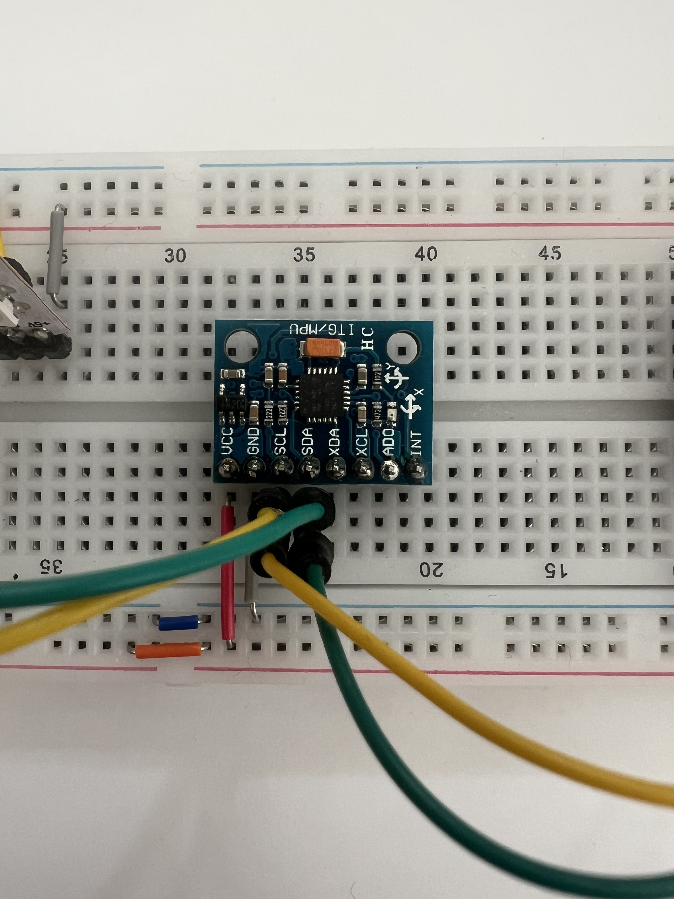

# MPU6050 · Bewegungssensor

Der MPU6050 misst Beschleunigung und Drehbewegung in drei Achsen. Über die **Adafruit-Bibliothek** liefert derselbe Aufruf zusätzlich die **On-Chip-Temperatur** in °C. Er eignet sich für Installationen, bei denen das Objekt bewegt, gekippt oder geschüttelt wird — oder bei denen z. B. Wärme oder Abkühlung eine Rolle spielt.

---

## Was er misst

- Beschleunigung auf X-, Y- und Z-Achse (Neigung, Erschütterung)
- Drehrate auf drei Achsen (Rotation)
- **Temperatur** (interner Sensor, °C) — mit `getEvent(..., &temp)` aus der Library

## Künstlerische Anwendungsszenarien

- Ein Objekt wird geneigt → eine LED reagiert auf den Winkel
- Jemand schüttelt das Gehäuse → ein Aktor wird ausgelöst
- Das Board selbst wird zur Geste
- Temperatur steigt oder fällt (Umgebung, Berührung, Licht) → Farbe oder Bewegung folgt dem Verlauf

## Wie er im Prompt beschrieben wird

> „...wenn das Objekt geneigt wird..."
> „...reagiert auf Bewegung des Boards..."
> „...gesteuert durch Neigung..."
> „...reagiert auf Temperatur..." / „...je wärmer desto..."

Wenn du explizit den MPU6050 nutzen willst, schreib es einfach so in den Prompt. Für **Temperatur** genügt ein Hinweis wie „Temperatur messen“ oder „wird wärmer“ — der GPT nutzt dann `getEvent` mit dem dritten Event (`temp.temperature`).

## Anschluss

Verbunden über I²C:
- SDA → GPIO 21
- SCL → GPIO 22

Bibliotheken: `Adafruit MPU6050`, `Adafruit Unified Sensor`

---

## Referenzen & Dokumentation

| Ressource | Link |
|---|---|
| MPU-6050 Datenblatt (TDK InvenSense) | [invensense.tdk.com · PDF](https://invensense.tdk.com/wp-content/uploads/2015/02/MPU-6000-Datasheet1.pdf) |
| MPU-6050 Register Map | [invensense.tdk.com · PDF](https://invensense.tdk.com/wp-content/uploads/2015/02/MPU-6000-Register-Map1.pdf) |
| Adafruit MPU6050 Library (GitHub) | [github.com/adafruit/Adafruit_MPU6050](https://github.com/adafruit/Adafruit_MPU6050) |
| Adafruit MPU6050 Library (PlatformIO) | [registry.platformio.org](https://registry.platformio.org/libraries/adafruit/Adafruit%20MPU6050) |
| Adafruit Unified Sensor (GitHub) | [github.com/adafruit/Adafruit_Sensor](https://github.com/adafruit/Adafruit_Sensor) |
| Adafruit Learn Guide MPU6050 | [learn.adafruit.com/mpu6050](https://learn.adafruit.com/mpu6050-6-dof-accelerometer-and-gyro) |
