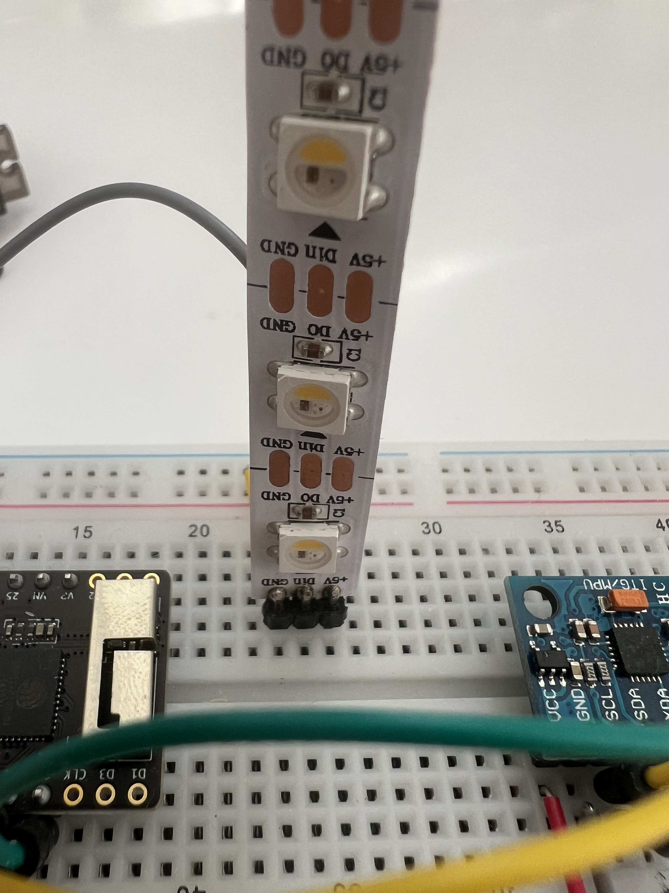

# NeoPixel Strip · LED-Streifen

Der NeoPixel-Strip besteht aus 6 einzeln ansteuerbaren LEDs. Jede LED kann jede Farbe darstellen und unabhängig von den anderen leuchten.

---

## Was er kann

- Helligkeit stufenlos regeln (0 = aus, 255 = maximale Helligkeit)
- Jede Farbe darstellen (RGB + Weißkanal)
- Animationen, Sequenzen, Verläufe darstellen

## Wie er im Prompt beschrieben wird

> „...die LEDs leuchten heller wenn..."
> „...der Strip zeigt die Intensität der Bewegung..."
> „...6 Pixel reagieren auf den Sensorwert..."

## Anschluss

- Datenleitung → **D6** (digital Pin 6)
- Typ: GRBW + KHZ800

Bibliothek: `Adafruit NeoPixel`

---

## Referenzen & Dokumentation

| Ressource | Link |
|---|---|
| WS2812B LED Datenblatt | [cdn-shop.adafruit.com · PDF](https://cdn-shop.adafruit.com/datasheets/WS2812B.pdf) |
| SK6812 RGBW Datenblatt (GRBW-Typ) | [pdf.datasheet.live · SK6812](https://pdf.datasheet.live/read/sk6812-rgbw.pdf) |
| Adafruit NeoPixel Library (GitHub) | [github.com/adafruit/Adafruit_NeoPixel](https://github.com/adafruit/Adafruit_NeoPixel) |
| Adafruit NeoPixel Library (PlatformIO) | [registry.platformio.org](https://registry.platformio.org/libraries/adafruit/Adafruit%20NeoPixel) |
| Adafruit NeoPixel Überguide | [learn.adafruit.com/adafruit-neopixel-uberguide](https://learn.adafruit.com/adafruit-neopixel-uberguide) |
