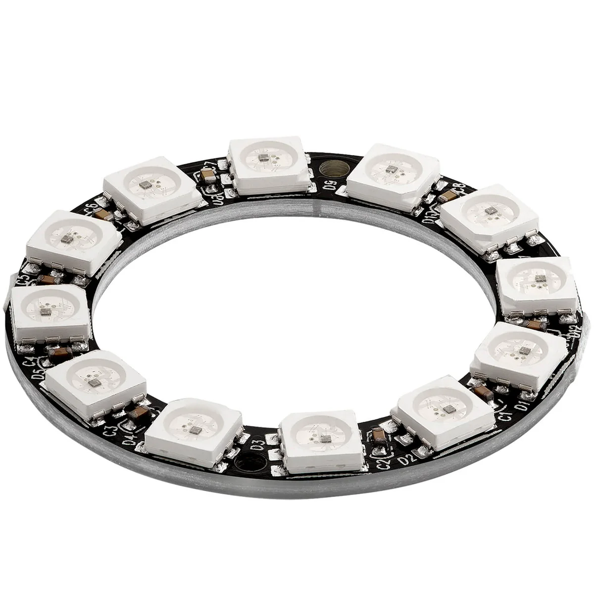

# NeoPixel-Ring · WS2812B (12 LEDs, 5V)

Im Workshop sitzt ein **NeoPixel LED Ring 5V RGB WS2812B** mit **12** einzeln ansteuerbaren **RGB-LEDs**. Jede „Einheit“ am Ring heißt im Code ein **Pixel** — nummeriert von **0** bis **11**. Man kann jede LED in Farbe und Helligkeit setzen, unabhängig von den anderen.

Die **Datenleitung** geht am Nano an **D6** (digitaler Ausgang), festgelegt in `02-hardware-pins.md`.

---

## Verdrahtung (Beispiel)

---

## Für Einsteiger: Wie funktioniert der Ring?

- **Ein Datenpin:** Alle LEDs hängen **in einer Kette** hintereinander. Der Nano schickt ein **digitales Signal** in eine Richtung; **Pixel 0** nimmt seinen Farbwert und leitet den Rest an **Pixel 1** weiter usw.
- **WS2812B:** Jede LED enthält einen winzigen Chip. Deshalb braucht man **keine** extra „Clock“-Leitung — nur **Daten** + **Strom** + **Masse**.
- **RGB:** Pro Pixel gibt es die Kanäle **Rot**, **Grün**, **Blau** (je 0–255). **Weiß** entsteht durch **gleiche** Werte, z. B. `Color(b, b, b)` — es gibt **keinen** separaten Weißkanal wie bei manchen RGBW-Streifen.

---

## Was der Ring kann

- **Helligkeit** stufenlos (pro Kanal 0–255; zusätzlich global mit `setBrightness()`)
- **Farben** und **Verläufe** über den Ring (z. B. „Lauflicht“, Regenbogen, Uhrzeiger-ähnliche Anzeige)
- **Rückmeldung** zu Sensoren: Abstand oder Bewegung als **Lichtintensität** oder **Farbe**

---

## Wie man ihn im Prompt beschreibt

> „…die LEDs am Ring leuchten heller, wenn…"  
> „…der Ring zeigt die Intensität der Bewegung…"  
> „…12 Pixel reagieren auf den Sensorwert…"

---

## Anschluss (Workshop)

| Anschluss | Nano / Hinweis |
|-----------|----------------|
| Daten (**DIN** / **DI** / **Data**) | **D6** |
| **5V** / **VCC** | **5V** (Strombedarf beachten — bei vielen LEDs lieber externes 5V mit gemeinsamer **GND**) |
| **GND** | **GND** (gemeinsame Masse mit dem Nano) |

**Library-Typ im Code:** **`NEO_GRB + NEO_KHZ800`** (üblich für WS2812B).

**Bibliothek:** `Adafruit NeoPixel`

---

## Strom und Sicherheit (wichtig für Anfänger)

- Jede LED kann bei **voller** Helligkeit **mehrere Milliampere** ziehen — **12** LEDs summieren sich. Wenn der Ring **flackert** oder der Nano **neu startet**, ist oft die **USB-Versorgung** am Limit.
- Pragmatisch im Workshop: **`setBrightness()`** moderat wählen (z. B. 40–80) und nicht alle Pixel dauerhaft auf **255/255/255** setzen.

---

## Referenzen & Dokumentation

| Ressource | Link |
|---|---|
| WS2812B LED Datenblatt | [cdn-shop.adafruit.com · PDF](https://cdn-shop.adafruit.com/datasheets/WS2812B.pdf) |
| Adafruit NeoPixel Library (GitHub) | [github.com/adafruit/Adafruit_NeoPixel](https://github.com/adafruit/Adafruit_NeoPixel) |
| Adafruit NeoPixel Library (PlatformIO) | [registry.platformio.org](https://registry.platformio.org/libraries/adafruit/Adafruit%20NeoPixel) |
| Adafruit NeoPixel Überguide | [learn.adafruit.com/adafruit-neopixel-uberguide](https://learn.adafruit.com/adafruit-neopixel-uberguide) |

Optional (anderes Bauteil, nicht Workshop-Standard): **SK6812 RGBW** — siehe Datenblatt und `NEO_GRBW` in der Library-Doku.
