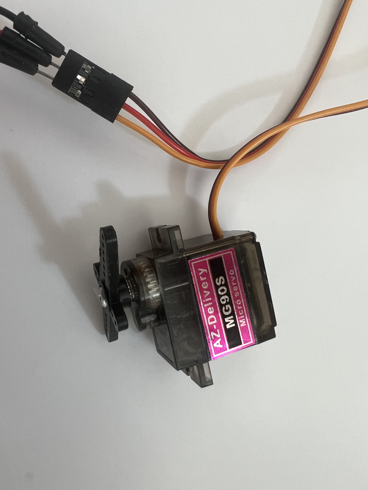

# Servo · Stellmotor

Ein Servo ist ein Motor, der sich auf einen bestimmten Winkel dreht und dort hält. Er eignet sich für Installationen, bei denen sichtbare, mechanische Bewegung stattfinden soll.

---

## Was er kann

- Sich auf einen Winkel zwischen 0° und 180° drehen
- Eine Position halten
- Auf einen Sensorwert reagieren (z.B. 0.0 → 0°, 1.0 → 180°)

## Künstlerische Anwendungsszenarien

- Eine Klappe öffnet sich wenn jemand näher kommt
- Ein Zeiger zeigt die Intensität einer Bewegung an
- Ein mechanisches Element reagiert auf das Netzwerk

## Wie er im Prompt beschrieben wird

> „...ein Servo dreht sich entsprechend der Neigung..."
> „...die Position des Motors hängt von der Geste ab..."
> „...Servo als Reaktion auf den Netzwerkwert..."

## Anschluss

- Signalleitung → GPIO 12

Bibliothek: `ESP32Servo`

---

## Referenzen & Dokumentation

| Ressource | Link |
|---|---|
| SG90 Servo Datenblatt | [servodatabase.com/SG90](https://servodatabase.com/servo/towerpro/sg90) |
| ESP32Servo Library (GitHub) | [github.com/madhephaestus/ESP32Servo](https://github.com/madhephaestus/ESP32Servo) |
| ESP32Servo Library (PlatformIO) | [registry.platformio.org](https://registry.platformio.org/libraries/madhephaestus/ESP32Servo) |
| Arduino Servo-Grundlagen | [docs.arduino.cc/libraries/servo](https://docs.arduino.cc/libraries/servo/) |
