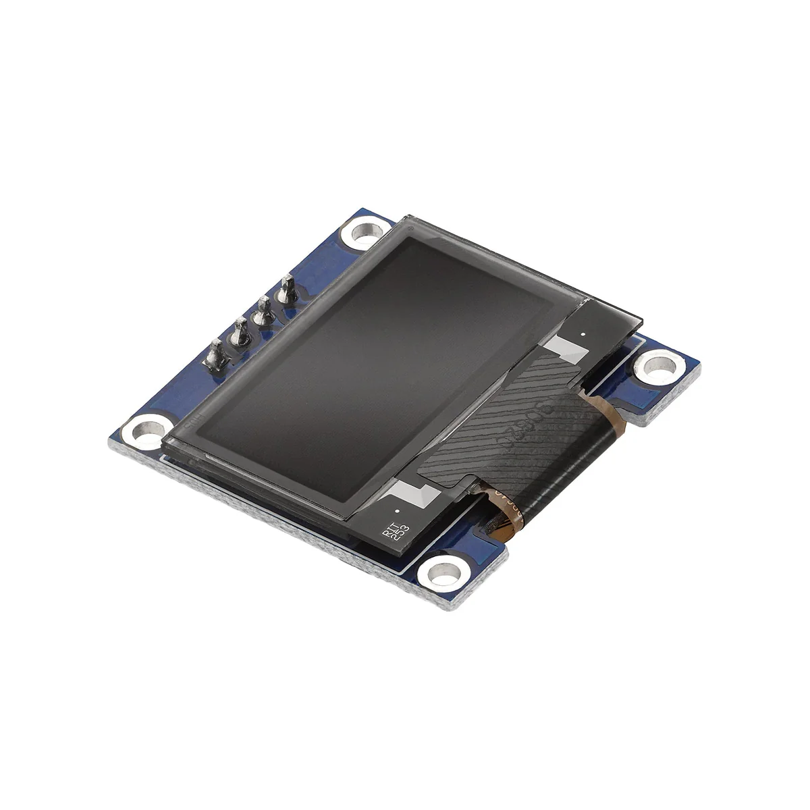

# SSD1306 OLED (128×64, I²C)

Das **OLED** (Organic Light-Emitting Diode) ist ein kleines **Display**, auf dem man **Text**, **Zahlen** und **einfache Grafik** sehr gut lesen kann — selbst bei normaler Raumbeleuchtung. Im Workshop nutzen wir ein **128×64**-Panel mit dem Chip **SSD1306** und Anbindung über **I²C** (nur wenige Kabel zum Arduino Nano).

---

## Für Einsteiger: Was bedeutet das?

- **128×64 Pixel:** Der Bildschirm ist **128** Spalten und **64** Zeilen „Bildpunkte“ breit/hoch. Für Text reicht das locker für mehrere Zeilen (Schriftgröße abhängig).
- **SSD1306:** Das ist der **Display-Controller** auf dem Breakout-Board. Die Software spricht mit diesem Chip — man muss die Pixel nicht einzeln „anpinseln“, das übernimmt die Library.
- **I²C:** Ein **serieller Bus** mit zwei Datenleitungen (**SDA**, **SCL**) plus **Strom** (**5V** / **3,3V** je nach Modul) und **Masse** (**GND**). Am **Nano** sind das **A4** (SDA) und **A5** (SCL) — dieselbe Leitung wie für RTC, Abstandssensor und MPU6050.

---

## Was man typischerweise auf dem Modul sieht

- **OLED-Glas** oder Plastikträger mit der aktiven Fläche (oft **0,96 Zoll** diagonal).
- **Pin-Leiste** oder Buchsen mit Beschriftung wie **GND**, **VCC**, **SCL**, **SDA** (manchmal **SCK** statt SCL — hier trotzdem **Takt** für I²C).
- Manchmal **Jumper** oder Lötpads zur **I²C-Adresse** (**0x3C** vs. **0x3D**) — wenn nichts umgesteckt ist, gilt meist **0x3C**.

---

## Workshop-Festlegung

| Thema | Wert |
|--------|------|
| Auflösung | **128×64** |
| Bus | **I²C** (Nano: **A4** = SDA, **A5** = SCL) |
| Adresse | **0x3C** (nur wenn das Modul **0x3D** zeigt: in Code und Doku anpassen) |
| Libraries | **Adafruit SSD1306** + **Adafruit GFX** |

Vor jedem I²C-Bauteil im `setup()`: **`Wire.begin()`**, danach **`display.begin(...)`** laut Beispiel / GPT-Code.

---

## Wofür man das OLED nutzt

- **Uhrzeit und Datum** von der **DS3231** anzeigen  
- **Abstände** vom **VL53L0X** als Zahl oder Balken  
- **Beschleunigung**, **Neigung** oder **Temperatur** vom **MPU6050** (wenn man sie im Prompt verlangt)  
- **Status** und **Fehlermeldungen** beim Testen ohne dauernd den **Serial Monitor** zu öffnen

---

## Tipps für gute Ergebnisse

- **Kontrast:** OLED ist selbstleuchtend — helle Schrift auf dunklem Grund wirkt sehr klar (Standard in vielen Beispielen).
- **Aktualisierung:** Das Display **nicht** in jeder `loop()`-Runde komplett neu fluten, wenn es nicht nötig ist — sonst flackert es oder die Schleife wird langsam. Nur **ändern**, was sich wirklich geändert hat, oder mit **`millis()`** langsamer takten.
- **Adresse falsch?** Wenn nichts erscheint, zuerst **Verdrahtung** und **Adresse** prüfen; manche Boards haben eine **Rückseitenbeschriftung** „0x3C“ / „0x3D“.

---

## Referenzen

| Ressource | Link |
|-----------|------|
| SSD1306 Datenblatt | [Solomon Systech SSD1306 (PDF)](https://cdn-shop.adafruit.com/datasheets/SSD1306.pdf) |
| Adafruit SSD1306 (GitHub) | [github.com/adafruit/Adafruit_SSD1306](https://github.com/adafruit/Adafruit_SSD1306) |
| Adafruit GFX | [github.com/adafruit/Adafruit-GFX-Library](https://github.com/adafruit/Adafruit-GFX-Library) |
| Monochrome OLED Breakouts (Adafruit Learn) | [learn.adafruit.com/monochrome-oled-breakouts](https://learn.adafruit.com/monochrome-oled-breakouts) |
