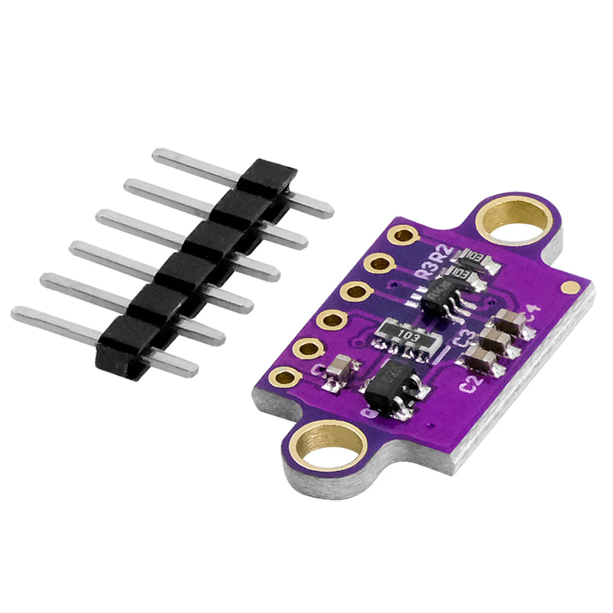

# VL53L0X (Time-of-Flight)

Der **VL53L0X** ist ein **Abstandssensor**: Er misst, wie weit ein **Objekt vor der Sensorfläche** ungefähr entfernt ist, und liefert das Ergebnis in **Millimetern (mm)**. Im Chip steckt eine **Time-of-Flight**-Messung (Laufzeit sehr kurzer Lichtimpulse) — umgangssprachlich oft „**Laser-Abstand**“ genannt, technisch im **infraroten** Bereich.

Im Workshop hängt der Sensor am **I²C-Bus** mit der Standardadresse **0x29** (wie in den Regeln `02-hardware-pins.md`).

---

## Für Einsteiger: Wie liest man die Werte?

- Der Sensor sendet ein **Lichtsignal** aus und wertet aus, wie schnell es **zurückkommt**. Daraus berechnet die Library eine **Entfernung**.
- **Ein Messwert** ist typischerweise eine **ganze Zahl** in **mm** (z. B. `187` mm). Sehr große oder spezielle Werte können auf **Timeout**, **kein Ziel** oder **schwierige Oberfläche** hindeuten — im Code sollte man das mit abfangen (z. B. `setTimeout`, Prüfung auf `timeoutOccurred()`).
- **Nicht jedes Material** reflektiert gleich gut: sehr dunkle, stark absorbierende oder stark schräge Flächen können die Messung erschweren. **Glatte, helle** Ziele in **senkrechter** Ausrichtung vor den Sensor zu halten ist am leichtesten.

---

## Wofür man den VL53L0X nutzt

- **Nähe** steuert **Helligkeit** oder Farbe am **NeoPixel-Ring**  
- **Abstand** steuert einen **Servo-Winkel** (z. B. nah = Tür zu, weit = Tür auf — je nach Idee)  
- **Schwellen:** „Wenn unter **200 mm**, dann …“  
- **Kombination mit Zeit:** z. B. nur zu bestimmten Zeiten reagieren (dazu die **DS3231** im Prompt einbeziehen)

---

## Messbereich und Grenzen (vereinfacht)

- **Nahbereich** und **Maximalreichweite** hängen von **Ziel**, **Beleuchtung** und **Einstellungen** in der Library ab (z. B. **Timing Budget**). Für den Workshop reicht oft: Werte **plausibel machen** (z. B. mit `constrain`) und **Ausreißer** ignorieren.
- **Nicht** die Messung in eine **sehr lange `delay()`**-Schleife packen — sonst wirkt die Installation träge. Besser: mit **`millis()`** nur alle **50 ms** oder **100 ms** messen und anzeigen.

---

## Bus und Strom

- **I²C:** **SDA** / **SCL** wie alle anderen Workshop-Sensoren auf dem Nano (**A4** / **A5**).  
- **Versorgung:** Modul mit **VCC** und **GND** an die **gleiche Masse** wie der Nano; Spannung laut Modulbeschriftung (**5V** oder **3,3V** — beim Kauf/Aufbau prüfen).

---

## Referenzen

| Ressource | Link |
|-----------|------|
| ST VL53L0X Datenblatt | [st.com · VL53L0X](https://www.st.com/resource/en/datasheet/vl53l0x.pdf) |
| Pololu VL53L0X Arduino Library | [github.com/pololu/vl53l0x-arduino](https://github.com/pololu/vl53l0x-arduino) |
