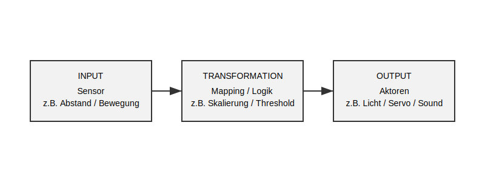
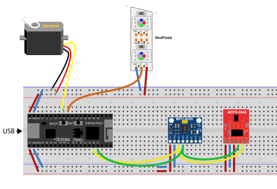
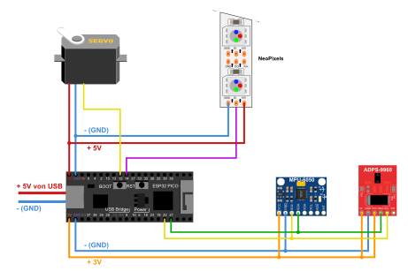

# Pathfinder Workshop  
Folkwang Universität der Künste  

## Worum es geht

Interaktive Systeme entstehen heute nicht mehr primär durch Programmieren, sondern durch **Beschreibung, Iteration und Dialog mit KI**.

Dieser Workshop untersucht einen zentralen Paradigmenwechsel:  
Large Language Models fungieren nicht länger nur als Werkzeuge, sondern als **aktive Co-Designer und Übersetzer zwischen Idee und technischer Umsetzung**. Sie transformieren Sprache direkt in funktionale Systeme – vom Sensor bis zur physischen Interaktion.

Am Beispiel des ESP32 wird sichtbar, wie sich diese Entwicklung konkret materialisiert:  
Teilnehmende beschreiben eine künstlerische oder performative Idee – und ein speziell konfiguriertes custom GPT-System generiert daraus lauffähigen Code, der unmittelbar auf Hardware übertragen werden kann.

Der Fokus liegt dabei nicht auf klassischer Programmierlogik, sondern auf:

- der Präzision von Beschreibung  
  *(Prompting als neue Entwurfspraxis)*
- der Iteration im Dialog mit KI
- dem Verständnis von KI-generierten Systemen als gestaltbare, aber nicht vollständig deterministische Prozesse

Der Workshop positioniert sich damit im aktuellen KI-Diskurs, in dem sich Softwareentwicklung zunehmend von einem handwerklichen zu einem **kuratorischen und konzeptionellen Prozess** verschiebt.

Gleichzeitig wird sichtbar, dass diese Systeme neue Kompetenzen erfordern:  
Während einfache Anwendungen bereits zuverlässig generiert werden können, stoßen komplexere Systeme schnell an Grenzen und erfordern gezielte Steuerung, Kontext und kritische Bewertung.

Der Workshop versteht sich daher nicht als reine Einführung in Tools, sondern als **Experimentierfeld für eine neue Form von Gestaltung**:  
**Interaktive Systeme entstehen durch Sprache, Vorstellung und kritische Reflexion – nicht mehr nur durch Code.**

---

## Niedrigschwelliger Einstieg

Trotz dieser theoretischen Einordnung ist der Workshop bewusst als **offener Einstieg** angelegt.  
Es sind keine Programmierkenntnisse erforderlich.

Der Zugang erfolgt über:

- eine Idee
- eine sprachliche Beschreibung
- einen KI-gestützten Entwicklungsprozess
- die direkte Übertragung auf physische Hardware

So wird sichtbar, wie KI technische Barrieren senken kann, ohne die gestalterische Komplexität zu reduzieren.

---

## Relevanz

KI verändert aktuell grundlegend, wie interaktive Systeme entworfen und entwickelt werden.

Statt Code Zeile für Zeile selbst zu schreiben, wird Entwicklung zunehmend zu einem Prozess aus:

- Beschreiben
- Kuratieren
- Testen
- Korrigieren
- Reflektieren

Sprache wird damit zu einem neuen Interface für Technologie.  
Zugleich verschiebt sich die Rolle der Gestaltenden: weg von der reinen Implementierung, hin zur Formulierung von Verhalten, zur Steuerung von Prozessen und zur kritischen Bewertung von Ergebnissen.

---

## Was passiert im Workshop

Im Workshop entstehen kleine vernetzte interaktive Systeme mit:

- ESP32 Mikrocontrollern
- Sensoren
- Aktoren wie LEDs und Servos
- KI-generiertem Code
- einem speziell konfigurierten GPT-System

Beispielhafte Anwendungen:

- Handbewegung steuert Licht und Farbe
- Distanz erzeugt Rotation oder physische Reaktion
- Gesten lösen audiovisuelle oder kinetische Ereignisse aus

---

## Grundprinzip

Technisch lässt sich jede Installation als Kette fassen: **Sensor** liefert Daten, dazwischen liegt **Transformation** (Mapping, Logik, Schwellen), **Aktoren** setzen das sichtbar oder beweglich um — genau so strukturieren auch sinnvolle Prompts die Anfrage an den GPT.



Der Ablauf im Workshop ist einfach:

1. Eine Idee oder Interaktion beschreiben  
2. Mit dem GPT-System daraus Code erzeugen  
3. Den Code auf den ESP32 übertragen  
4. Testen, verändern, verbessern
5. Vernetzen
6. Verhalten, Ergebnis und Logik reflektieren 

---


## Kontext: KI, Gestaltung und Physical Computing

Der Workshop berührt mehrere aktuelle Entwicklungslinien:

### Von „No-Code“ zu „Post-Code“

Der Workshop soll nicht einfach suggerieren, dass Programmierung verschwindet.  
Treffender ist: **Code verschwindet nicht, sondern rückt in eine nachgelagerte Ebene**.

Der Schwerpunkt verlagert sich vom manuellen Schreiben von Code zur Beschreibung von Verhalten, zur Auswahl geeigneter Lösungen und zur kritischen Revision maschinell erzeugter Vorschläge.

### KI als Interface und KI als Material

Im Workshop kann KI auf zwei Weisen verstanden werden:

- **KI als Interface**  
  Sprache wird zum Interface für technische Systeme.

- **KI als Material**  
  Verhalten, Unschärfen, Missverständnisse und Fehler der KI können selbst Teil einer gestalterischen Auseinandersetzung werden.

Gerade im künstlerischen Kontext ist beides relevant.

### Embodied AI / Physical Computing

Ein besonders spannender Aspekt liegt darin, dass KI den Bildschirm verlässt und in Objekte, Räume und körperliche Interaktion übergeht.

Der Workshop kann daher auch als Annäherung an eine Entwicklung verstanden werden, bei der aus sprachlicher Beschreibung unmittelbar physisch erfahrbare Systeme entstehen:  
**vom Prompt zur physischen Realität**.

---

## Kritische Perspektiven

Der Workshop will KI nicht nur als Erleichterung zeigen, sondern auch Fragen sichtbar machen, die im aktuellen Diskurs zentral sind:

- Wer versteht den generierten Code tatsächlich?
- Was bedeutet Autorschaft in einem KI-gestützten Entwicklungsprozess?
- Wo liegt die Grenze zwischen technischem Fehler und ästhetischem Verhalten?
- Welche neuen Kompetenzen entstehen, wenn Beschreibung wichtiger wird als Implementierung?

Diese Fragen sind kein Nebenthema, sondern Teil der gestalterischen Praxis.

---

## 🔗 Custom GPT

Custom GPTs von Open AI liefern signifikant bessere Ergebnisse wenn man als Nutzer eingelogged ist!!

**[→ FOLWANG-PairLink GPT direkt öffnen](https://chatgpt.com/g/g-69b6eda5e8888191b2000af26055b60b-folwang-pairlink-starter)**

**[→ Custom GPT Dataset herunterladen](./GPT_Dataset_Pathfinder.zip)** — System Prompt + alle Trainingsdateien als ZIP

---

## Der Workflow in drei Schritten

```
1. GPT-Anfrage stellen   →   Idee in Sprache beschreiben
2. Code in PlatformIO    →   Einfügen, fertig
3. Auf Controller laden  →   Upload, testen
```

Kein manuelles Programmieren. Kein Verständnis von Syntax notwendig.

---

## Inhalt

| Abschnitt | Inhalt |
|---|---|
| [00 Setup](./00_setup/README.md) | Git, VS Code, PlatformIO, Treiber — die Installation notwendiger Komponenten Schritt für Schritt erklärt |
| [01 Komponenten](./01_komponenten/README.md) | Alle elektronischen Bauteile im Detail erklärt |
| [02 PairLink](./02_pairlink/README.md) | Die Bibliothek für den Datenaustausch zwischen ESP32 Microcontrollern |
| [03 Workflow](./03_workflow/README.md) | Der Workflow im Detail · [Beispielprompts](./03_workflow/pathfinder_prompts.md) · [Prompt-Baukasten](./03_workflow/prompt_patterns_baukasten.md) |
| [04 Beispiele](./04_beispiele/README.md) | Drei vollständige Beispiele mit Workflow-Durchläufen |
| [05 Custom GPT](./05_custom_gpt/README.md) | Wie das Custom GPT funktioniert — und wie man sein eigenes bauen/anpassen kann |

---

## Im Workshop verwendete Hardware

- ESP32-PICO-KIT (Espressif Entwicklungsboard · ESP32-PICO-D4 · WLAN + BT eingebaut)
- APDS9960 (Gesten, Nähe, Umgebungslicht und Farbe)
- MPU6050 (Bewegung, Lage, On-Chip-Temperatur)
- NeoPixel RGBW LED-Streifen (6 Pixel)
- Servomotor (0-180 Grad Rotation)

### Steckplatine und Schaltplan

Der **Aufbau auf der Steckplatine** und der **Schaltplan** zeigen dasselbe Workshop-Set: alle Bauteile und ihre Verbindungen. Details zu einzelnen Komponenten stehen in [01 Komponenten](./01_komponenten/README.md).





Alle Komponenten sind vorkonfiguriert. Pins und Bibliotheken sind fest im GPT eingebaut — es muss nichts konfiguriert werden.

---

*Folkwang Universität der Künste · Workshop Interaktive Systeme*
